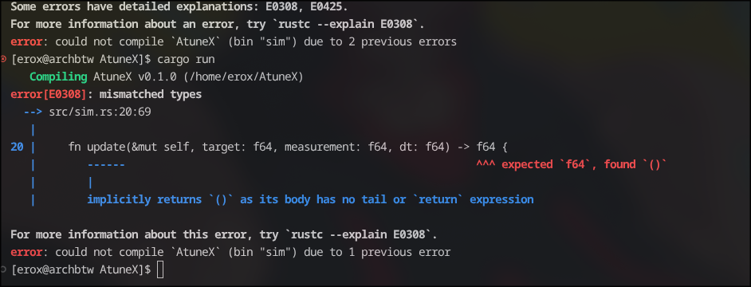
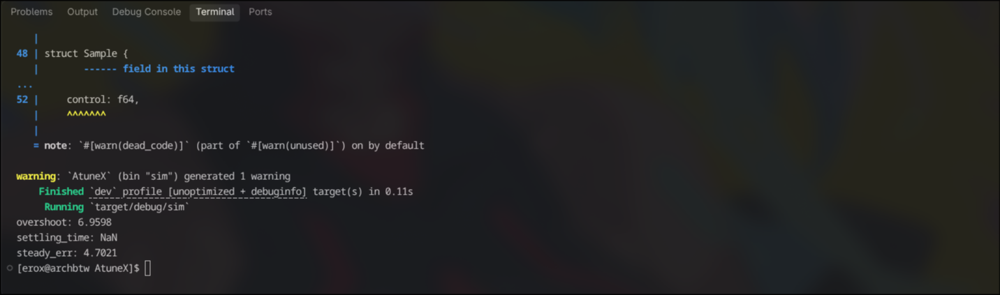

## Sept 30

Hyo , i am erox and today i started the project ,i just init'd the repo and made the required cargo files with "cargo init" .

Started with fake parameters and wrote `sim.rs` , it contains a basic code for fixing the fake car's pid it is still psuedo code , but it might work i think so , wait wait why the hell does it have  `let derivative = (error - self.prev_err) / dt;` ??? ik  i am a fool but not tht much to forget the dt = 0 case, lol . lemme fix it right now , done  `let derivative = (error - self.prev_err) / (dt + 0.000001) ;` wait now i feel like i am an even bigger fool , i shld have done `assert!(dt > 0);` but wait again tht not like me imma gonna do `if dt <= 0.0 {return 0.0;}` , maybe i have 200+iq .

Now on this commit i added samples of time target measurement and controll output also some basic metrics like overshoot , settling_time and steady_err. Done no gonna go to more details , its my journal not "Explanation please :]" hell naw , not even over my dead body . So next i am gonna make it modules right after it gets atleasts each fn 50+ lines .
btw the current code still feels like psuedo code idk why ? maybe because i didnt test it out?

oh encountered some errs , fixed them and again they come at last i struced with this one 

looks like needa go to gpt hehe 

oh ho it works now finally 

but wait the measurments are off track , looks like my fake motor rejected my fake 10s timer lol . ok looks like needa tune the thing tht i ignored mewhe .

## Oct 1

ok so today gonna break things , into modules and really break it as i suck lol . ok so gonna make main.rs , pid.rs , sim.rs and scan.rs tht shld be enough , right? yeah probably enough after the simulation works i will go ahead and switch the sim.rs with something like penetrate_esp_code_hahaha.rs wait i forgot to put grave accent or whatever "`" <- this thing is called , like hell i care i was doin tht on the first journal .

ok so now the self procalimed psuedo god of destruction gonna break sim.rs hahaha i am so evil , breaking working code is so fun , fixing isnt .

oh its pretty easy , copy frm sim and paste on pid lol .

ok now i wrote a minimal main.rs and tried to test pid with it but rust cant find it hm ohh i forgot to rm [[bin]] in my cargo lol
 