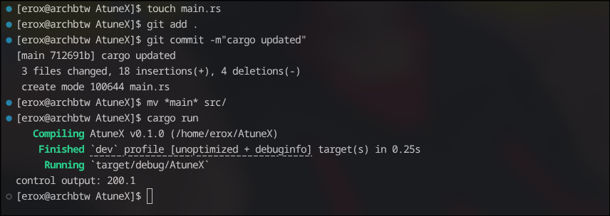
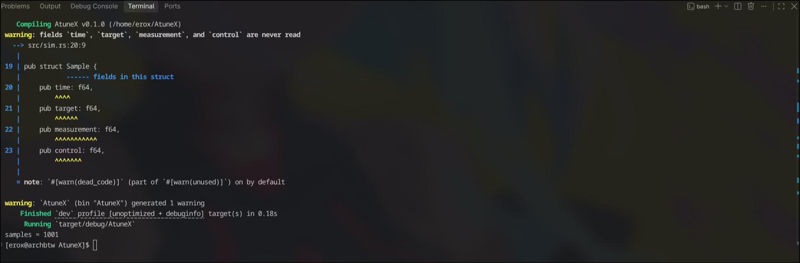
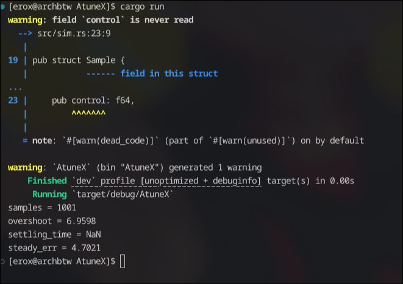
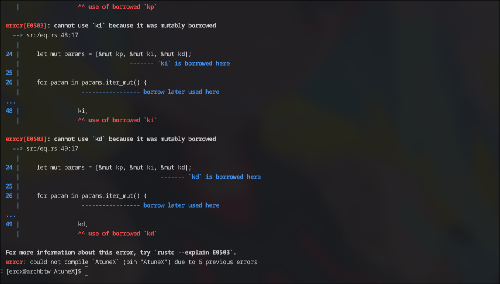

## Sept 30

Hyo , i am erox and today i started the project ,i just init'd the repo and made the required cargo files with "cargo init" .

Started with fake parameters and wrote `sim.rs` , it contains a basic code for fixing the fake car's pid it is still psuedo code , but it might work i think so , wait wait why the hell does it have  `let derivative = (error - self.prev_err) / dt;` ??? ik  i am a fool but not tht much to forget the dt = 0 case, lol . lemme fix it right now , done  `let derivative = (error - self.prev_err) / (dt + 0.000001) ;` wait now i feel like i am an even bigger fool , i shld have done `assert!(dt > 0);` but wait again tht not like me imma gonna do `if dt <= 0.0 {return 0.0;}` , maybe i have 200+iq .

Now on this commit i added samples of time target measurement and controll output also some basic metrics like overshoot , settling_time and steady_err. Done no gonna go to more details , its my journal not "Explanation please :]" hell naw , not even over my dead body . So next i am gonna make it modules right after it gets atleasts each fn 50+ lines .
btw the current code still feels like psuedo code idk why ? maybe because i didnt test it out?

oh encountered some errs , fixed them and again they come at last i struced with this one 

looks like needa go to gpt hehe 

oh ho it works now finally 

but wait the measurments are off track , looks like my fake motor rejected my fake 10s timer lol . ok looks like needa tune the thing tht i ignored mewhe .

## Oct 1

ok so today gonna break things , into modules and really break it as i suck lol . ok so gonna make main.rs , pid.rs , sim.rs and scan.rs tht shld be enough , right? yeah probably enough after the simulation works i will go ahead and switch the sim.rs with something like penetrate_esp_code_hahaha.rs wait i forgot to put grave accent or whatever "`" <- this thing is called , like hell i care i was doin tht on the first journal .

ok so now the self procalimed psuedo god of destruction gonna break sim.rs hahaha i am so evil , breaking working code is so fun , fixing isnt .

oh its pretty easy , copy frm sim and paste on pid lol .

ok now i wrote a minimal main.rs and tried to test pid with it but rust cant find it hm ohh i forgot to rm [[bin]] in my cargo lol
 
 why is cargo still acting like dora the expolrer? cant he see my main.rs is right there on src , wait wait maybe i am the shit head lemme run pwd , HOLY SHIT ,its on root not src how can one be such a fool?

ok it works now lol . maybe sleep wasnt optional !

ok now gonna work on sim , at first eliminated old sim b adding ~ before it , it will waver his will lol .

wait matte i shld have gotten 1000 samples not 1001 huh 

anyways just +-1 isnt  an err wait lemme rerun , oh same result , gonna fix it later 

okk i added metrics.rs  

ok metric works fine , just tht 1001 sample sickens me lol

## Oct 2

Yo here we again , today gonna write the scan.rs and do a lot of other work tht i havent yet decided . The scan rs will be one of the most important part of the atunex poc , as in simulation i wont use any ml or maybe i will anyways lemme describe my mental model of scan.rs , matte , why the hell did i name it scan.rs? its doin a lot of heavy work and the name will make it feel like a daemon while it is the de itself lol , so i feel pity and gonna name it . Oh perfect i got a good name eq.rs as the equalizer.rs shrt form , perfect as it flattens the err and protects the equilibrium , looks like i am influenced frm rimuru .

i made the architecture pretty easy run the simulation , check the error , change one pid value , run it again and store what happened . basically fake sim but with structs and f64 .Frankly made an Test struct to store kp ki kd , the error and the metrics because if i am gonna experiment then i better actually remember what tf happened .

ao its like test in fake world , measure , compare , store , compare , store .... pick the best but but i am doing it in simulation because it is just a poc before i try on real hardware . hmhm ! 
now time to upgradde the main.rs and ship the poc , rejoice to the self proclaimed psuedo god of bugs . 

heh i knew it , thts why my name is self proclaimed psuedo god of bug 

without a ownershit battle how can i even compile?

oh fixed it by using another function , tht ownership bug wasnt even considered as a sub boss , let final boss be alone .

 
hey hey am i dreaming? how the hell 0.00.. err? nah something is probably off i can gaurentee my code is never perfect . huh nice try lil bug i will fix you .

but i wanna live inside this dream , 0% not even 0.0001% its **HELLA 0%** ahhhhh .

so needa write a readme now , ah how boaring i wd rather rice my hyprland but i need readme looks like cant do anything uf. Alos i forgot to del the ~sim.rs maybe i will let it live? hell nah i am merciless .