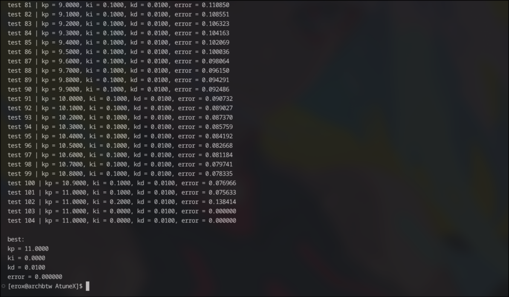

# AtuneX

Atunex is a rust based cli qol tool made for embedded guys like , who hates to tune pid like me .

> Its currently just the simulation version , i made it as working poc , on next ship i will make it working on real hardware

## Desc

It is a pid helper tool , currently it is not applicable on real hardware as current version is only a simulation , it runs experiment , measures the result , tweaks the vals and then repeat a few times and find the closest pid with minimal err (though somehow its currently giving me 0.0% err and idk why?) .


## feature

- simulate a simple motor
- run a pid controller for the motor
- collect simulation samples
- calculate some basic performance 
- test different Kp, Ki, and Kd values
- keep a history of the tests
- find the best result based on the current error metric

## mechanics 

it starts with some pid and then runs the simulation , post-simulation , he scans the result , sees the diff of err with diff ki , kd , kp params and then selects the best where err is minimum , though the current version uses steady state err to decide which param val is better , i think to add a ml for it BUT LATER not now .

here take a look at my tree ./src 

```
./src
├── eq.rs
├── main.rs
├── metric.rs
├── pid.rs
├── ~sim.rs
└── sim.rs

1 directory, 6 files
```

ignore the ~* file , its the first version , in one file also it didnt have the eq portion .

## Run 

```sh
cargo run
```

yeah thts all no need to do anything else

### SC



this photo shows a complete iteration of `cargo run` , but i am still surprized abt the 0.0....0% steady err 

## Limits 

- The simulations motors are very basic and moddest 
- the simulation isnt real at all
- cant work on hardware 

## Tech used to build it 

I am a rustacean 
I use arch btw

## things to do on v2

- support real hardware 

## Why i built it ?

because tuning pid manually suck 

## Author 

I , me mineself erox aka dipanjan 

## Licence

check it here 

[License](./LICENSE)